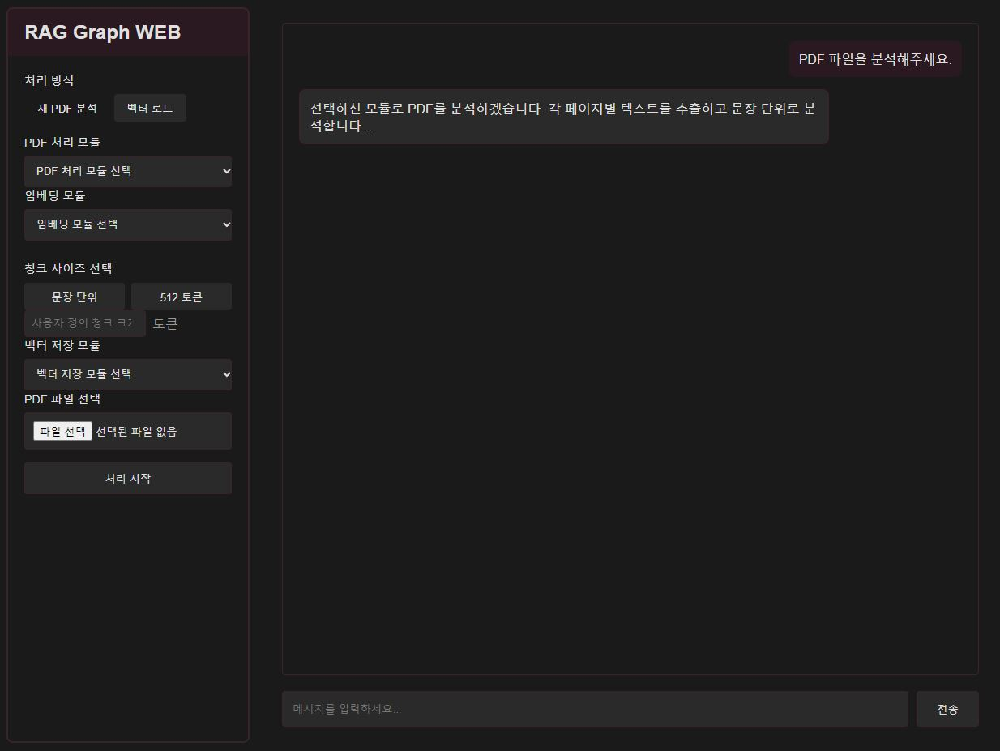

# Graph_web

PDF 문서를 분석하고 벡터 데이터베이스에 저장하여 대화형 검색을 수행할 수 있는 웹 애플리케이션입니다.

## 주요 기능

- PDF 처리 모듈 (PDFPlumber, PyPDF2, PDFMiner)을 통한 텍스트 추출
- 임베딩 모듈 (OpenAI, SentenceTransformer)을 사용한 텍스트 벡터화
- 청크 분할 옵션 (문장 단위, 토큰 단위)
- Chroma DB를 활용한 벡터 저장 및 검색
- 대화형 RAG (Retrieval-Augmented Generation) 인터페이스

## 기술 스택

- **Backend**
  - FastAPI
  - LangChain Graph
  - OpenAI API
  - SentenceTransformers
  - ChromaDB

- **Frontend**
  - HTML/CSS/JavaScript (Vanilla)

## 메인화면


## 설치 방법

1. 프로젝트 클론
```bash
git clone 
cd Graph_web
```

2. 가상환경 생성 및 활성화
```bash
python -m venv venv
source venv/bin/activate  # Linux/Mac
# or
venv\Scripts\activate  # Windows
```

3. 의존성 설치
```bash
pip install -r requirements.txt
```

4. 환경 변수 설정
```bash
# Linux/Mac
export OPENAI_API_KEY="your-api-key"

# Windows
set OPENAI_API_KEY=your-api-key
```

## 실행 방법

```bash
uvicorn main:app --reload
```
서버 실행 후 `http://localhost:8000` 접속

## 프로젝트 구조

```
rag-graph-web/
├── main.py              # FastAPI 메인 애플리케이션
├── PDFgraph.py          # PDF 처리 및 벡터 저장 로직
├── requirements.txt     # 프로젝트 의존성
├── static/
│   └── styles.css      # 스타일시트
├── templates/
│   └── index.html      # 메인 웹 인터페이스
└── db/                 # Chroma DB 저장소 (자동 생성)
```
